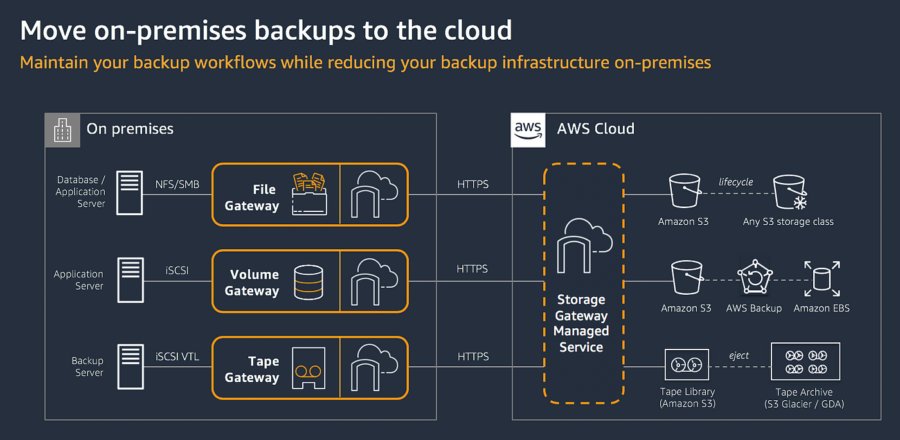

# 🗄️ **Amazon Storage Gateway**

**Amazon Storage Gateway** seamlessly integrates your on-premises IT environment with AWS storage services, enabling efficient and secure data management between local infrastructure and the cloud.

    

---

## 🔗 **What is Storage Gateway?**

**Amazon Storage Gateway** is a hybrid cloud storage service that enables your on-premises applications to seamlessly use AWS cloud storage. It `connects` your on-premises IT environment with AWS storage services like Amazon S3, Amazon S3 Glacier (object-based), and Amazon FSx (file-based) for file and/or block storage.

### **Deployment Options:**

1. **Virtual Machine (VM):**

   - **Installation:** Download from AWS and install in your virtualized environment on-premises (e.g., VMware ESXi, Microsoft Hyper-V, or KVM).

2. **Physical Appliance:**
   - **Preinstalled:** Comes with Storage Gateway preinstalled.
   - **Interfaces:** Exposes SMB, NFS, or iSCSI interfaces based on the gateway configuration.
   - **Security:** Utilizes HTTPS to encrypt data in transit and Server-Side Encryption with Amazon S3-Managed Keys (SSE-S3) for data at rest in S3.
   - **Efficiency:** Transfers only changed data and employs data compression to optimize performance.

---

## 📂 **Storage Gateway Configurations**

Amazon Storage Gateway offers several configurations, each tailored to specific use cases and storage needs:

### 🗄️ **S3 File Gateway**

**S3 File Gateway** presents an NFS or SMB interface to your on-premises clients, enabling seamless integration with Amazon S3.

#### **Key Features:**

- **File Shares:** Acts as a file share (file system) mount to store files directly to Amazon S3.
- **Client Compatibility:** Accessible by both in-AWS and on-premises Windows and Linux clients.
- **S3 Integration:** Supports S3 Lifecycle policies, versioning, and Cross-Region Replication (CRR) for efficient object management.
- **Low Latency Access:** Utilizes local caching of frequently accessed files to ensure quick access.
- **Security:** Data is encrypted in transit and compressed to optimize storage.
- **API Access:** Files stored in S3 can be accessed by AWS applications through the S3 API.

#### **Use Cases:**

- **Data Migration:** Easily migrate file data to Amazon S3.
- **Backup Solutions:** Utilize S3 as a robust backup destination.
- **Cloud Bursting:** Extend your on-premises storage to the cloud for scalability.

---

### 💾 **Volume Gateway**

**Volume Gateway** offers block storage volumes that can be accessed by your on-premises applications using the iSCSI protocol.

#### **Configurations:**

1. **Stored Volume**
2. **Cached Volume**

#### 🗄️ **Stored Volume**

**Stored Volume** configuration stores primary data on-premises while asynchronously backing up point-in-time snapshots to Amazon S3.

##### **Key Features:**

- **On-Premises Storage:** Provides block storage volumes and exposes an iSCSI interface to your servers.
- **Local Storage:** Virtual block storage volumes are stored locally on the customer's infrastructure.
- **Snapshot Backups:** Volume snapshots are asynchronously backed up to Amazon S3 for disaster recovery (DR) or backup purposes.
- **AWS Integration:** Can be run on Amazon EC2 instances in AWS as a volume gateway.

##### **Use Cases:**

- **Disaster Recovery:** Ensure data availability and durability by maintaining backups in S3.
- **Backup Solutions:** Leverage local storage for primary data and S3 for backups.

#### 💾 **Cached Volume**

**Cached Volume** configuration uses Amazon S3 as the primary storage for your block volumes while retaining frequently accessed data on-premises for low-latency access.

##### **Key Features:**

- **Primary Storage in S3:** Most of your data resides in Amazon S3, reducing on-premises storage costs.
- **Local Caching:** Frequently accessed data is cached locally on-premises to ensure quick access.
- **Snapshot Capabilities:** Supports snapshots of virtual volumes for data protection and recovery.
- **AWS Integration:** Can be deployed on Amazon EC2 instances as a volume gateway.

##### **Use Cases:**

- **Storage Migration:** Migrate storage to Amazon S3 while minimizing local storage costs.
- **Efficient Data Access:** Access frequently used data quickly without relying on continuous network connectivity.

---

### 🎞️ **Tape Gateway**

**Tape Gateway** provides a cloud-backed virtual tape library (VTL) for backup and archival applications.

#### **Key Features:**

- **Virtual Tape Storage:** Uses Amazon S3 as the primary storage for virtual tapes.
- **Archival Storage:** Archives are stored in Amazon S3 Glacier as Virtual Tape Shelves (VTS) for long-term retention.
- **iSCSI Interface:** Presents an iSCSI interface to your backup servers, mimicking traditional tape libraries.
- **Deployment:** Can be installed on an Amazon EC2 instance to provide a tape gateway within AWS.
- **Security:** Utilizes HTTPS and data compression to securely transfer data to S3.

#### **Use Cases:**

- **Backup Solutions:** Replace traditional tape-based backup systems with a scalable cloud solution.
- **Archival Storage:** Store long-term archives securely in Amazon S3 Glacier.

---

### 🖥️ **FSx File Gateway**

**FSx File Gateway** provides low-latency, efficient access to Amazon FSx file systems from your on-premises clients.

#### **Key Features:**

- **Low Latency Access:** Ensures quick access to FSx for Windows File Server shares by caching frequently accessed data locally.
- **SMB Interface:** Exposes an SMB interface to on-premises clients, enabling seamless integration with Windows environments.
- **Network Requirements:** Requires a Direct Connect (DX) or VPN connection to facilitate communication with the file server and allow the file server to join the on-premises Active Directory (AD) domain.
- **Deployment Options:** Can be deployed on a Storage Gateway VM appliance or as a hardware appliance.

#### **Use Cases:**

- **Enterprise File Sharing:** Provide efficient file sharing capabilities for Windows-based environments.
- **Hybrid Workloads:** Enable seamless integration between on-premises and AWS-based file storage.

---

## ⚖️ **Comparison**

### **Amazon FSx File Gateway 🆚 Amazon FSx for Windows**

While Amazon FSx for Windows File Server is accessible from on-premises environments, FSx File Gateway enhances this by providing local caching, reduced latency, optimized bandwidth utilization, seamless hybrid integration, and improved disaster recovery capabilities. This makes it particularly valuable for environments with specific performance and availability requirements.

**Key Advantages of FSx File Gateway:**

1. **Low Latency Access**:

   - **Cached Access**: FSx File Gateway provides local caching, allowing frequently accessed data to be stored locally, which reduces latency for on-premises users.
   - **Optimized Performance**: This can be crucial for applications that require fast access to frequently used files without relying on direct access to the cloud.

2. **Efficient Bandwidth Utilization**:

   - **Data Caching**: By caching data locally, FSx File Gateway reduces the amount of data that needs to be transferred over the network, saving bandwidth and reducing costs.
   - **Optimized Data Transfer**: This is particularly useful for environments with limited or expensive network bandwidth.

3. **Seamless Integration**:

   - **Hybrid Workloads**: It enables a seamless integration between on-premises applications and cloud-based FSx for Windows File Server, supporting hybrid workloads where data is generated and processed locally but needs to be stored centrally in the cloud.
   - **Centralized Management**: This allows centralized management of data while providing local access to users and applications.

4. **Disaster Recovery and Business Continuity**:
   - **Local Access During Outages**: In case of a network outage or other issues affecting connectivity to the cloud, the local cache in FSx File Gateway ensures continued access to critical files.
   - **Backup and Restore**: It can also facilitate efficient backup and restore operations by leveraging cloud storage while ensuring local availability.

### **Storage Gateway 🆚 AWS DataSync**

Choosing between **Amazon Storage Gateway** and **AWS DataSync** depends on your specific data transfer and storage integration needs. Here's a comparison to help you decide:

**Amazon Storage Gateway:**

- **Type:** Hybrid cloud storage service.
- **Functionality:** Integrates on-premises applications with AWS storage services (S3, S3 Glacier, FSx).
- **Use Case:** Ideal for ongoing hybrid storage needs, such as backups, disaster recovery, and extending local storage to the cloud.
- **Access:** Provides persistent access to data via file or block interfaces (NFS, SMB, iSCSI).
- **Data Transfer:** Transfers data over existing network connections (Internet or Direct Connect).

**AWS DataSync:**

- **Type:** Online data transfer service.
- **Functionality:** Automates and accelerates bulk data transfers between on-premises storage and AWS storage services.
- **Use Case:** Best suited for large-scale migrations, data replication, and periodic data transfers.
- **Access:** Focuses solely on data movement without providing ongoing access to data.
- **Data Transfer:** Utilizes optimized network protocols for high-speed transfers, up to 10x faster than traditional tools.

**Key Takeaway:**

- Use **Amazon Storage Gateway** for **ongoing hybrid storage integration** with persistent access to data.
- Use **AWS DataSync** for **automated, accelerated bulk data migrations** without the need for ongoing access.

---

## 🛠️ **How Storage Gateway Works**

Understanding the workflow of **Amazon Storage Gateway** helps in effectively leveraging its capabilities for your storage needs.

### **1. Deployment**

- **Virtual Appliance:**

  - **Download:** Obtain the Storage Gateway VM from AWS.
  - **Install:** Deploy it in your virtualized environment (e.g., VMware ESXi, Microsoft Hyper-V, or KVM).

- **Physical Appliance:**
  - **Setup:** Receive the preinstalled Storage Gateway appliance from AWS.
  - **Connect:** Integrate it into your on-premises network.

### **2. Configuration**

- **Select Gateway Type:**

  - Choose between **File Gateway**, **Volume Gateway**, or **Tape Gateway** based on your requirements.

- **Set Up Interfaces:**

  - Configure SMB, NFS, or iSCSI interfaces as needed.

- **Network Integration:**
  - Ensure connectivity via existing network infrastructure or establish connections using AWS Direct Connect or VPN.

### **3. Data Integration**

- **Connect Applications:**

  - Mount the Storage Gateway as a file system or block storage on your applications.

- **Data Transfer:**

  - Data written to the gateway is either cached locally or directly transferred to AWS storage services.

- **Security Measures:**
  - Data is encrypted in transit using HTTPS and at rest using AWS encryption mechanisms.

### **4. Management and Monitoring**

- **AWS Management Console:**

  - Use the console to monitor gateway status, manage configurations, and oversee data transfers.

- **AWS CloudWatch:**
  - Integrate with CloudWatch for detailed monitoring and alerting on gateway performance and health.

---

## 🏁 **Conclusion**

**Amazon Storage Gateway** is a powerful hybrid cloud storage solution that bridges your on-premises infrastructure with AWS storage services. Whether you're looking to migrate data, implement robust backup solutions, or extend your storage capabilities to the cloud, Storage Gateway provides the tools and configurations to meet your needs effectively.

### **Benefits of Using Storage Gateway:**

- **Seamless Integration:** Connects on-premises applications with AWS storage without disrupting existing workflows.
- **Scalability:** Easily scale your storage needs by leveraging AWS's vast storage infrastructure.
- **Security:** Ensures data is securely transferred and stored with encryption in transit and at rest.
- **Cost Efficiency:** Optimize storage costs by utilizing AWS storage classes and minimizing on-premises storage requirements.
- **Flexibility:** Offers multiple configurations (File, Volume, Tape) to cater to diverse storage and migration scenarios.
