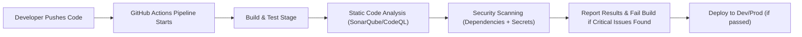

# 🧠 Integrated Security Scanning & Static Code Analysis in CI/CD (GitHub Actions Edition)

## 🚀 What Does It Mean?

When we talk about _“integrated security scanning”_ and _“static code analysis”_ in a CI/CD pipeline, we’re basically saying:

> “Let’s automatically check our code for vulnerabilities and bad practices every time someone pushes code, before it reaches production.”

Think of it like an automated **security guard + code reviewer** 👮‍♂️🔍 sitting inside your GitHub Actions pipeline.

---

## 🧩 Two Major Types of Checks

| Type                                                              | Purpose                                                                                                                    | Example Tools                                     |
| ----------------------------------------------------------------- | -------------------------------------------------------------------------------------------------------------------------- | ------------------------------------------------- |
| 🧱 **Static Code Analysis (SAST)**                                | Analyzes your **source code** without running it, to find bugs, performance issues, and security vulnerabilities.          | SonarQube, CodeQL, ESLint, Pylint                 |
| 🦠 **Security Scanning (Dependency Scanning / Secrets Scanning)** | Checks your **dependencies, Docker images, or commits** for known vulnerabilities, exposed secrets, and misconfigurations. | Dependabot, Trivy, Snyk, GitHub Advanced Security |

---

## 🧬 How It Fits into CI/CD (GitHub Actions Flow)

Let’s visualize this first 👇



✅ This ensures **only clean, secure code** moves to deployment.

---

## ⚙️ Example Workflow: Static Analysis + Security Scanning

Here’s a **realistic GitHub Actions YAML** setup combining both 👇

```yaml
name: Secure CI Pipeline

on:
  push:
    branches: [main]
  pull_request:
    branches: [main]

jobs:
  build:
    runs-on: ubuntu-latest

    steps:
      - name: Checkout repository
        uses: actions/checkout@v4

      # 🧠 Static Code Analysis (Example: CodeQL)
      - name: Initialize CodeQL
        uses: github/codeql-action/init@v3
        with:
          languages: javascript

      - name: Build code
        run: npm install && npm run build

      - name: Perform CodeQL Analysis
        uses: github/codeql-action/analyze@v3

      # 🧱 Linting / Static Quality Checks
      - name: Run ESLint
        run: npm run lint

      # 🦠 Security Scan (Example: Trivy)
      - name: Security scan with Trivy
        uses: aquasecurity/trivy-action@master
        with:
          scan-type: "fs"
          ignore-unfixed: true
          vuln-type: "os,library"
          format: "table"
          exit-code: "1"
```

### 💡 What Happens Here:

1. **CodeQL** → Scans the source code for security flaws (SQL injection, unsafe inputs, etc.).
2. **ESLint** → Ensures coding standards and clean syntax.
3. **Trivy** → Checks for vulnerable dependencies or base images (if you have Docker).

If any of these steps fail → ❌ pipeline stops before deployment → 🛡️ _security first_.

---

## 📊 How You Get Results

After every run, GitHub gives you:

- **Code Scanning Alerts** → In the “Security” tab of your repo.
- **Pull Request Annotations** → Inline comments showing exactly where the issue is.
- **Trivy Reports** → In the Actions logs (and optionally export as JSON).

This means developers see security issues **right next to their code**, not buried in reports 🧠💥.

---

## 🧰 Optional (But Common) Add-Ons

| Category              | Tool                                | Purpose                                    |
| --------------------- | ----------------------------------- | ------------------------------------------ |
| 🧩 Dependency Updates | Dependabot                          | Auto-creates PRs for outdated dependencies |
| 🔒 Secret Scanning    | GitHub Advanced Security / Gitleaks | Detects accidentally committed secrets     |
| 🐳 Image Scanning     | Trivy / Snyk Container              | Scans Docker images for CVEs               |
| 📈 Quality Gate       | SonarCloud                          | Blocks PRs unless quality threshold met    |

---

## 🧠 Best Practices

✅ **Shift Left Security:** Scan code early (in PRs, not just before deploy).
✅ **Fail Fast:** Stop the pipeline if high-severity issues are found.
✅ **Use Baselines:** Avoid blocking existing known issues; only fail on _new_ ones.
✅ **Automate Dependency Updates:** Dependabot keeps libraries patched.
✅ **Review Reports Regularly:** Don’t ignore warnings — triage them weekly.

---

## 🧨 Real-World Example Flow

Imagine you’re building a Node.js API:

1. Developer pushes a PR 🚀
2. GitHub Actions runs:

   - ESLint → found unused variable ✅
   - CodeQL → found potential SQL injection ❌
   - Trivy → found vulnerable `lodash` dependency ⚠️

3. Build fails with clear logs → Developer fixes issues → Re-pushes.
4. Pipeline passes → Deploys to staging ✅

👏 That’s integrated DevSecOps in action.

---

## 🧩 Summary (TL;DR)

| Stage               | Tool               | Purpose                           |
| ------------------- | ------------------ | --------------------------------- |
| **Static Analysis** | CodeQL / SonarQube | Detect code-level vulnerabilities |
| **Linting**         | ESLint / Pylint    | Enforce style and rules           |
| **Dependency Scan** | Trivy / Snyk       | Check third-party packages        |
| **Secrets Scan**    | Gitleaks / GitHub  | Find exposed keys/tokens          |
| **Auto Updates**    | Dependabot         | Keep dependencies fresh           |

---

Would you like me to create a **visual full CI/CD diagram (Dev → Build → Scan → Deploy)** showing where each scanning tool fits (with emojis and color labels)?
It’ll make the concept visually unforgettable 🎨
