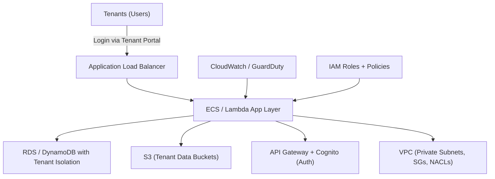

# 🏗️ Architected Multi-Tenant SaaS Infrastructure on AWS

_(With Secure Networking & Least Privilege Access)!_

---

## 📖 **What It Means in Simple Words**

You built an **application (SaaS)** that serves **multiple customers (tenants)** — but **each customer’s data and traffic are isolated and secure**, even though everything runs on the same AWS infrastructure.

Basically:

> “You designed a shared cloud system on AWS where many customers can safely use the same app, but they **can’t see or affect each other’s data** — and you did it with tight security rules.”

---

## 🧩 Key Concepts Broken Down

| Term                             | Simple Meaning                                                                                                    |
| -------------------------------- | ----------------------------------------------------------------------------------------------------------------- |
| **SaaS (Software as a Service)** | One application used by many customers (like Gmail, where every user has their own mailbox).                      |
| **Multi-tenant**                 | All customers share the same app, but their data and configs are kept separate.                                   |
| **Secure networking**            | Data moves through private AWS networks (not open internet), using tools like VPC, Subnets, Security Groups, etc. |
| **Least privilege access**       | Every user, app, or service gets _only_ the permissions they truly need — nothing extra.                          |

---

## 🏗️ Example Architecture (Visually)



---

## 🪜 **Step-by-Step Breakdown**

### 1️⃣ **Multi-Tenant Design**

- All tenants use the **same application codebase**, but:

  - Each has a **separate database schema** (or partition key if DynamoDB).
  - Tenant ID is included in every API request to ensure data isolation.

- Example:

  ```sql
  SELECT * FROM Orders WHERE TenantId = 'T123';
  ```

  → ensures Tenant A never sees Tenant B’s data.

---

### 2️⃣ **Secure Networking**

You keep the internal traffic safe and isolated using AWS networking components:

| AWS Service                       | Purpose                                                         |
| --------------------------------- | --------------------------------------------------------------- |
| **VPC (Virtual Private Cloud)**   | Your private network inside AWS.                                |
| **Subnets**                       | Public for load balancers, private for databases & app servers. |
| **Security Groups (SGs)**         | Firewall rules allowing only necessary communication.           |
| **NACLs**                         | Optional extra network filters at subnet level.                 |
| **PrivateLink / Transit Gateway** | For connecting securely across VPCs or accounts.                |

🧠 Example:

- Only the **App server** can talk to the **Database**.
- No one can directly access the DB from the internet.

---

### 3️⃣ **Least Privilege Access (IAM Security)**

This is all about **“deny by default”** — give minimal power.

| Actor       | Example IAM Policy                                                     | Meaning                                   |
| ----------- | ---------------------------------------------------------------------- | ----------------------------------------- |
| App Lambda  | `"Action": ["s3:GetObject"], "Resource": "arn:aws:s3:::tenant-data/*"` | App can only read S3 data, not delete it. |
| Developer   | `"Action": ["rds:DescribeDBInstances"]`                                | Can check DBs but can’t modify them.      |
| Tenant user | Limited API calls via Cognito tokens                                   | Can only manage their own tenant data.    |

🔒 Principle:
**Each role/service has access only to what it needs. Nothing more.**

---

### 4️⃣ **Data Isolation Techniques**

You can isolate tenant data in multiple ways:

| Model                         | Description                                          | Example                              |
| ----------------------------- | ---------------------------------------------------- | ------------------------------------ |
| **Database per tenant**       | Each tenant has its own DB (best for large clients). | RDS instance per customer            |
| **Schema per tenant**         | Shared DB, separate schemas.                         | `tenant_a.orders`, `tenant_b.orders` |
| **Shared DB with tenant key** | One DB, rows tagged with tenant ID.                  | `WHERE tenant_id = ?`                |

---

### 5️⃣ **Monitoring and Auditing**

To keep everything secure and auditable:

- **CloudWatch** → logs performance & metrics.
- **AWS Config** → tracks config changes.
- **GuardDuty / Inspector** → detects suspicious behavior.
- **CloudTrail** → records who did what and when.

---

## 📝 **Example Real Scenario**

Imagine you built a SaaS CRM like HubSpot on AWS:

- Customers = Tenants (`CompanyA`, `CompanyB`)
- Each has its own data in DynamoDB tables.
- Code runs in ECS under same service, but queries are filtered by tenant ID.
- IAM ensures ECS tasks can’t touch other tenants’ S3 buckets.
- Networking uses VPC → private subnets → NAT Gateway → no public DB exposure.

➡️ So even if one company’s account is compromised, others stay safe. 💪

---

## ✅ **Best Practices**

- ✅ Use **tenant-aware logging** (log tenant ID).
- ✅ Encrypt everything (S3, RDS, EBS) with **KMS keys**.
- ✅ Implement **VPC isolation per tenant** for high-security clients.
- ✅ Apply **resource tagging** for cost tracking and access control.
- ✅ Continuously **scan and monitor** with AWS Security Hub.

---

## 🔍 **Summary Table**

| Layer          | AWS Service           | Security Principle          |
| -------------- | --------------------- | --------------------------- |
| **Network**    | VPC, SG, NACL         | Isolate traffic per layer   |
| **Identity**   | IAM Roles & Policies  | Least privilege             |
| **Data**       | RDS, S3, DynamoDB     | Encrypt + Isolate by Tenant |
| **Access**     | Cognito, API Gateway  | Auth per Tenant             |
| **Monitoring** | CloudTrail, GuardDuty | Audit everything            |
