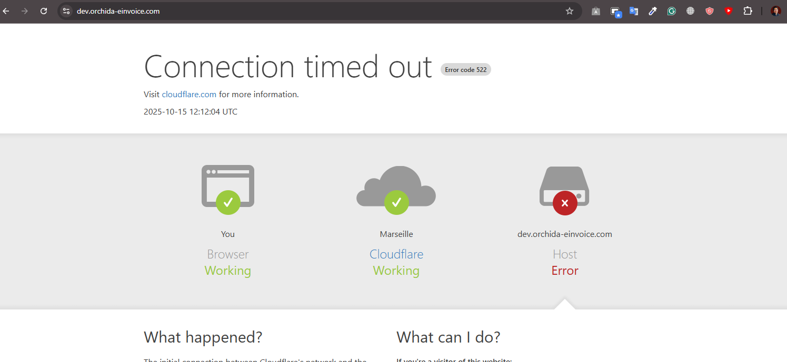
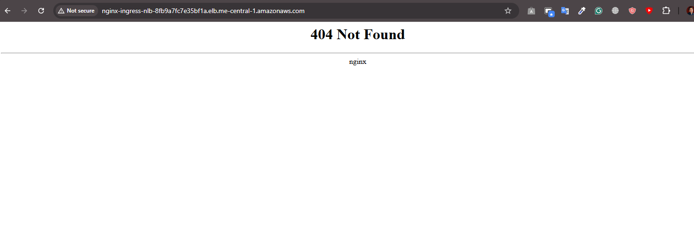
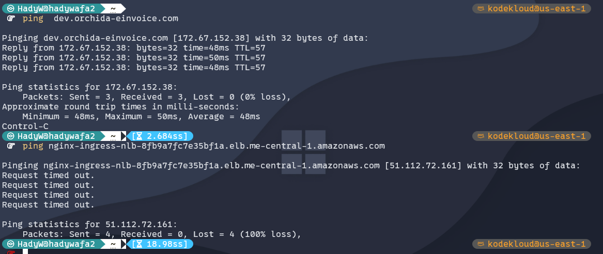
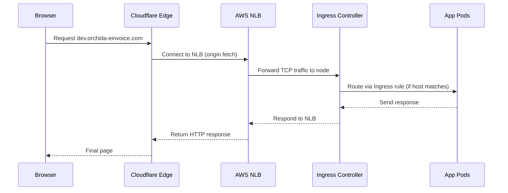

# 🌩️ Full Breakdown: Why `dev.orchida-einvoice.com` Shows 522 and 404, and Why Ping Behaves Differently







## 🧱 Your Setup (Recap)

You have:

- **AWS EKS (Kubernetes)** cluster
- **Public Network Load Balancer (NLB)** in 3 Availability Zones

  - Listeners: TCP 80, 443, and ICMP (though ICMP doesn’t actually apply)
  - Target group: worker node security group

- **NGINX Ingress Controller** deployed in cluster
- **Cloudflare DNS**

  - CNAME record:
    `dev.orchida-einvoice.com → nginx-ingress-nlb-xxxxxxxx.elb.me-central-1.amazonaws.com`
  - Orange cloud (proxy) = ON

---

## 🧭 1️⃣ DNS and Traffic Flow Overview

Here’s how your request flows:



If any step fails, you get an error depending on where it breaks:

| Step Fails At        | Error You See               | Meaning                               |
| -------------------- | --------------------------- | ------------------------------------- |
| Browser ↔ Cloudflare | ❌ Browser DNS or SSL issue | Local problem                         |
| Cloudflare ↔ AWS NLB | ❌ Error **522**            | Cloudflare can’t connect to origin    |
| NLB ↔ NGINX          | ✅ 404 or ❌ timeout        | NLB reachable but backend not routing |
| NGINX ↔ Pods         | ❌ 502 / 503                | Ingress rule or service mismatch      |

---

## ⚙️ 2️⃣ Cloudflare 522 Explained (and Why It Happened)

**Error 522 = TCP connection timed out between Cloudflare and your AWS NLB.**

### 🧩 Root Causes

1. **AWS NLB doesn’t respond to Cloudflare’s connection**

   - Security group allows `0.0.0.0/0`? ✅ Fine.
   - But some AZ IPs may not have healthy targets → no backend responding.

2. **Cross-zone load balancing disabled**

   - Cloudflare may connect to an NLB IP from a different AZ where no targets exist.

3. **Cloudflare’s IPs blocked**

   - Cloudflare sends traffic from its own edge IPs, not your PC’s IP.
   - Ensure SG allows Cloudflare IP ranges ([https://www.cloudflare.com/ips/](https://www.cloudflare.com/ips/)).

4. **TLS/HTTP mismatch**

   - Cloudflare SSL mode “Flexible” sends HTTP → origin expects HTTPS → handshake fails.
   - Use **Full (Strict)** to match origin SSL.

### ✅ Fix Summary

| Check                     | Setting                            |
| ------------------------- | ---------------------------------- |
| Security group            | Allow 80/443 from Cloudflare IPs   |
| Cross-zone load balancing | Enabled                            |
| Target group health       | Healthy ✅                         |
| SSL mode                  | Full (Strict)                      |
| Ingress host              | Matches `dev.orchida-einvoice.com` |

---

## 🧩 3️⃣ Why You See 404 from NLB Directly

When you hit:

```
http://nginx-ingress-nlb-xxxxxxxx.elb.me-central-1.amazonaws.com
```

NLB forwards your request to NGINX Ingress, but with:

```
Host: nginx-ingress-nlb-xxxxxxxx.elb.me-central-1.amazonaws.com
```

If your Ingress manifest is defined like:

```yaml
rules:
  - host: dev.orchida-einvoice.com
    http:
      paths:
        - path: /
          backend:
            service:
              name: myapp-service
              port:
                number: 80
```

Then the Host **doesn’t match**, so NGINX returns a default:

```ini
404 Not Found
nginx
```

✅ This proves:

- NLB works.
- Ingress controller is alive.
- The only missing piece is host-based routing for `dev.orchida-einvoice.com`.

---

## 🧠 4️⃣ Why Ping Behaves Differently

Short answer:

- **You can ping `dev.orchida-einvoice.com`** because you’re pinging **Cloudflare’s edge IP**. Cloudflare _does_ reply to ICMP.
- **You can’t ping the AWS NLB** (`…elb.me-central-1.amazonaws.com`) because **AWS Network Load Balancers do not implement ICMP**. Security Groups/NACLs can “allow ICMP,” but the NLB itself doesn’t speak ping, so it will always time out.

So your results are expected:

| What you ping                                        | Who answers                           | ICMP support | Result      |
| ---------------------------------------------------- | ------------------------------------- | ------------ | ----------- |
| `dev.orchida-einvoice.com` (orange cloud ON)         | Cloudflare edge (e.g., 172.67.152.38) | Yes          | ✅ Replies  |
| `nginx-ingress-nlb-….elb.me-central-1.amazonaws.com` | AWS NLB per-AZ IPs                    | **No**       | ❌ Timeouts |

A few key clarifications:

- An NLB is Layer-4 for **TCP/UDP/TLS** only. There is **no such thing as an NLB “listener” for ICMP**—that setting doesn’t exist. Even if your SG/NACL “allow ICMP,” the device must implement ICMP echo; NLB does not.
- Your Cloudflare DNS record for `dev` may be a CNAME to the ELB name, but with **proxy (orange cloud) enabled**, clients resolve to **Cloudflare IPs**, not your NLB IPs. That’s why ping works for `dev`—you’re pinging Cloudflare, not AWS.
- If you turn the cloud **grey (DNS-only)**, `dev` will resolve directly to the NLB’s IPs and **ping will time out**—exactly like pinging the ELB name—because NLB still doesn’t do ICMP.

### How to test properly (don’t use ping)

Use TCP/HTTP checks:

```bash
# Does the LB accept TCP on 80/443?
# (Linux)
timeout 5 bash -c 'cat < /dev/null > /dev/tcp/dev.orchida-einvoice.com/80' && echo OK || echo FAIL
timeout 5 bash -c 'cat < /dev/null > /dev/tcp/dev.orchida-einvoice.com/443' && echo OK || echo FAIL

# HTTP(S) via Cloudflare (what users hit)
curl -I http://dev.orchida-einvoice.com
curl -I https://dev.orchida-einvoice.com

# Direct-to-origin test with correct Host/SNI (bypasses Cloudflare)
# Replace <NLB_IP> with one of the ELB IPs from nslookup
curl -I --resolve dev.orchida-einvoice.com:443:<NLB_IP> https://dev.orchida-einvoice.com
```

### If you still see Cloudflare 522

That’s **not** about ping. It means Cloudflare can’t complete a TCP connection to your origin. Check:

1. **Target group health** (correct port/path; targets healthy).
2. **Cross-zone load balancing** on the NLB (prevents “some IPs work, others time out”).
3. **Security Groups/NACLs** allow 80/443 **from Cloudflare IP ranges** (Cloudflare → origin).
4. **Cloudflare SSL mode** = **Full (Strict)** if origin expects HTTPS.
5. **Ingress rules** include `host: dev.orchida-einvoice.com` (your 404 on raw ELB proves unmatched host).

Bottom line:

- Ping works for `dev` only because Cloudflare replies to ICMP.
- Ping never works for the AWS NLB. That’s by design. Use TCP/HTTP checks to validate reachability.

---

Let’s decode what’s happening, why Cloudflare shows `522`, and how the 404 proves it’s a routing issue — not a networking issue.

---

| Target                                     | Actual Server               | ICMP Response | Reason                                      |
| ------------------------------------------ | --------------------------- | ------------- | ------------------------------------------- |
| `dev.orchida-einvoice.com`                 | Cloudflare Edge (172.x.x.x) | ✅ Replies    | Cloudflare proxies DNS and responds to ICMP |
| `nginx-ingress-nlb-xxxx.elb.amazonaws.com` | AWS NLB                     | ❌ Timeout    | NLB doesn’t implement ICMP                  |

Even if you open ICMP in your SG/NACL, **NLB doesn’t understand ping**. It’s a layer 4 TCP/UDP balancer only.

👉 Always test with `curl` or `telnet`, not `ping`:

```bash
curl -I http://dev.orchida-einvoice.com
curl -I https://dev.orchida-einvoice.com
```

---

## 🔍 5️⃣ What You’ve Proven So Far

| Test                            | Result     | Meaning                                       |
| ------------------------------- | ---------- | --------------------------------------------- |
| `ping dev.orchida-einvoice.com` | ✅ replies | Cloudflare edge reachable                     |
| `ping nginx-ingress-nlb...`     | ❌         | AWS NLB doesn’t do ICMP                       |
| Browser to NLB                  | 404        | NGINX reachable but host mismatch             |
| Browser to Cloudflare           | 522        | Cloudflare can’t connect to NLB (TCP timeout) |

---

## 🛠️ 6️⃣ Step-by-Step Fix Roadmap

1️⃣ **Fix origin reachability**

- Allow 80/443 from Cloudflare IP ranges in NLB + node SGs
- Enable **cross-zone load balancing** on NLB
- Confirm target group health checks pass

2️⃣ **Fix Cloudflare SSL configuration**

- Set SSL mode = **Full (Strict)**
- Upload valid cert to Ingress (or use cert-manager)

3️⃣ **Verify Ingress YAML**

```yaml
apiVersion: networking.k8s.io/v1
kind: Ingress
metadata:
  name: dev-ingress
  annotations:
    kubernetes.io/ingress.class: nginx
    service.beta.kubernetes.io/aws-load-balancer-type: nlb
spec:
  tls:
    - hosts:
        - dev.orchida-einvoice.com
      secretName: dev-tls
  rules:
    - host: dev.orchida-einvoice.com
      http:
        paths:
          - path: /
            pathType: Prefix
            backend:
              service:
                name: myapp-service
                port:
                  number: 80
```

4️⃣ **(Optional)** Test bypassing Cloudflare:

```bash
curl -I --resolve dev.orchida-einvoice.com:443:<NLB_IP> https://dev.orchida-einvoice.com
```

If that works → Cloudflare issue
If that fails → AWS/NLB/K8s issue

---

## ✅ 7️⃣ Final Expected Behavior (After Fixes)

| Path                                 | What Happens                  |
| ------------------------------------ | ----------------------------- |
| Browser → Cloudflare → NLB → Ingress | ✅ 200 OK                     |
| Browser → NLB directly               | 404 (expected, no host match) |
| Ping to dev.                         | ✅ Cloudflare replies         |
| Ping to NLB                          | ❌ (normal)                   |

---

## 🧾 TL;DR

- Ping fails → normal (NLB ≠ ICMP device).
- 404 from NLB → NGINX is alive but host mismatch.
- 522 → Cloudflare can’t connect to your origin (blocked/unhealthy backend).
- Fix: Allow Cloudflare IPs, enable cross-zone, verify Ingress host + SSL.

---

Would you like me to include a **recommended Cloudflare + AWS diagram** (with DNS + SSL + NLB + Ingress routing flow) so you can visualize how all pieces fit together?
