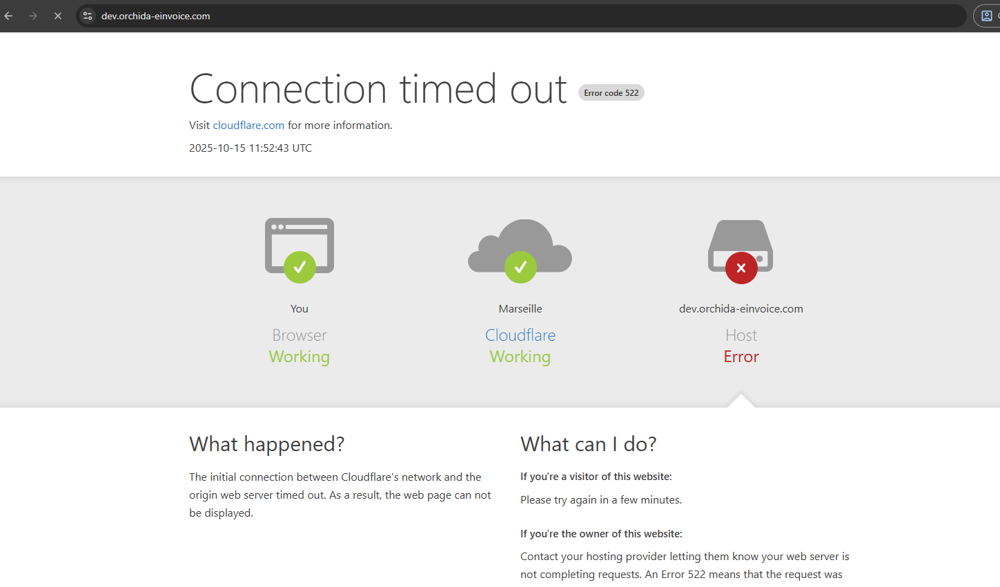

Excellent question 👏 — you actually understand 90% of it already.
Let’s connect the remaining 10% — the subtle (but important) difference between **publicly routable** and **publicly accessible**, and what Cloudflare’s _real_ role is here.

---




## 🌐 1️⃣ Yes — the AWS NLB Is Public

You’re absolutely right:
`nginx-ingress-nlb-8fb9a7fc7e35bf1a.elb.me-central-1.amazonaws.com` is an **AWS public Network Load Balancer**.

- ✅ It’s **publicly routable** — AWS advertises those IPs (like `40.172.x.x`, `158.x.x.x`) on the internet.
- ✅ AWS handles **DNS resolution** — the `.elb.amazonaws.com` domain maps to one or more public IPs (one per AZ).
- ✅ You opened **ports 80, 443, ICMP** to `0.0.0.0/0`, so from the network perspective, **anyone can reach it**.

But... 👇

---

## 🚧 2️⃣ “Routable” ≠ “Accessible (at L7)”

Just because TCP/443 is open doesn’t mean your **application (Ingress)** will respond to every HTTP request.

NGINX Ingress works by **matching Host headers** defined in your Ingress rules.

Example:

```yaml
apiVersion: networking.k8s.io/v1
kind: Ingress
metadata:
  name: app
spec:
  rules:
    - host: dev.orchida-einvoice.com
      http:
        paths:
          - path: /
            pathType: Prefix
            backend:
              service:
                name: my-service
                port:
                  number: 80
```

When you curl like this:

```bash
curl nginx-ingress-nlb-8fb9a7fc7e35bf1a.elb.me-central-1.amazonaws.com
```

your `Host` header is:

```ini
Host: nginx-ingress-nlb-8fb9a7fc7e35bf1a.elb.me-central-1.amazonaws.com
```

No match found in the Ingress rules → NGINX returns nothing or resets the connection.

So the port is reachable, but **your app routing logic** drops the request.

---

## ☁️ 3️⃣ What Cloudflare Actually Does

Cloudflare’s DNS + proxy adds two layers of functionality:

### (a) **DNS Resolution Layer**

If the orange cloud is _off_, Cloudflare simply resolves `dev.orchida-einvoice.com` → your NLB’s public IP.  
It’s a normal CNAME — DNS-only. No magic.  
✅ In this mode, traffic flows **directly from client → AWS NLB.**

### (b) **Reverse Proxy Layer**

If the orange cloud ☁️ is _on_, Cloudflare becomes a **reverse proxy**.  
The flow now becomes:

```ini
Browser → Cloudflare (terminates SSL) → Cloudflare connects to your NLB over HTTPS
```

So now:

- The **client never sees your AWS IPs.**
- Cloudflare injects the correct `Host: dev.orchida-einvoice.com` header.
- Cloudflare applies caching, DDoS protection, rate limiting, etc.
- Cloudflare may restrict **direct access to the NLB**, because only Cloudflare’s IPs are whitelisted.

That’s why:

- Direct access to `nginx-ingress-nlb...` fails (wrong host header or blocked).
- Access via `dev.orchida-einvoice.com` works fine (Cloudflare handles it).

---

## 🧭 4️⃣ Think of It Like a Middleman

| Step                 | Without Cloudflare       | With Cloudflare (Proxy ON)                      |
| -------------------- | ------------------------ | ----------------------------------------------- |
| DNS                  | dev → NLB IP             | dev → Cloudflare edge IP                        |
| Client connects to   | NLB directly             | Cloudflare edge                                 |
| SSL terminated at    | NLB                      | Cloudflare (and optionally re-encrypted to NLB) |
| Host header sent     | dev.orchida-einvoice.com | Same (Cloudflare preserves it)                  |
| IP visible to public | NLB IPs                  | Cloudflare IPs                                  |
| Ping to NLB works?   | No (ICMP blocked by NLB) | No (Cloudflare blocks ICMP too)                 |
| Protection           | None                     | CDN + WAF + DDoS Shield                         |

---

## 🧩 5️⃣ In Your Case

Right now, your record:

```ini
dev CNAME nginx-ingress-nlb-8fb9a7fc7e35bf1a.elb.me-central-1.amazonaws.com
```

…is going through Cloudflare.
Cloudflare is doing **both**:

- DNS resolution (translating name → IP)
- And (likely) **proxying the HTTP/HTTPS traffic**

So yes, the AWS NLB is public, but:

- You’re **not talking to it directly** from your browser.
- Cloudflare **sits in front**, receiving requests and then forwarding them properly.

---

## ✅ TL;DR

| Concept             | Who Handles It                               | Notes                                   |
| ------------------- | -------------------------------------------- | --------------------------------------- |
| DNS name resolution | Cloudflare DNS                               | Points your subdomain to AWS NLB domain |
| TCP/IP routing      | AWS                                          | NLB is public and routable              |
| HTTP handling       | NGINX Ingress                                | Needs matching `Host` header            |
| SSL termination     | Cloudflare (proxy mode) or AWS (if DNS-only) | Depends on orange cloud                 |
| Ping (ICMP)         | Not supported by NLB or Cloudflare           | Timeouts are normal                     |
| Security layer      | Cloudflare (optional)                        | Adds WAF, hides AWS IPs                 |

---

👉 **In short:**
Cloudflare isn’t “just resolving DNS.” When the orange cloud is on, it **terminates requests, rewrites headers, re-encrypts traffic, and acts as a secure middle layer** between the internet and your AWS load balancer.

---

Would you like me to show you what happens if you disable the orange cloud (DNS-only mode) and what the curl results would look like in each case?
