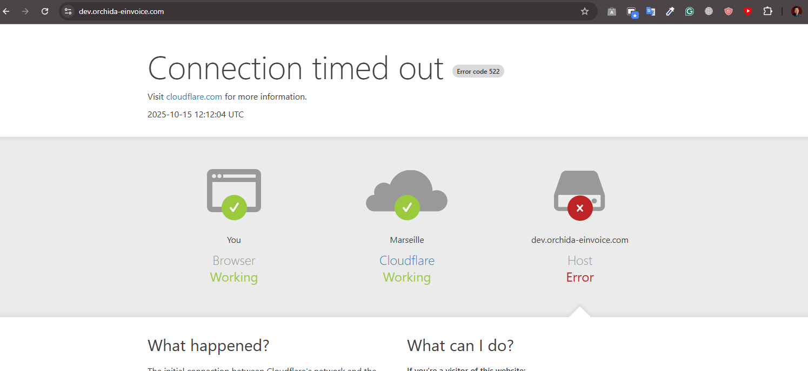
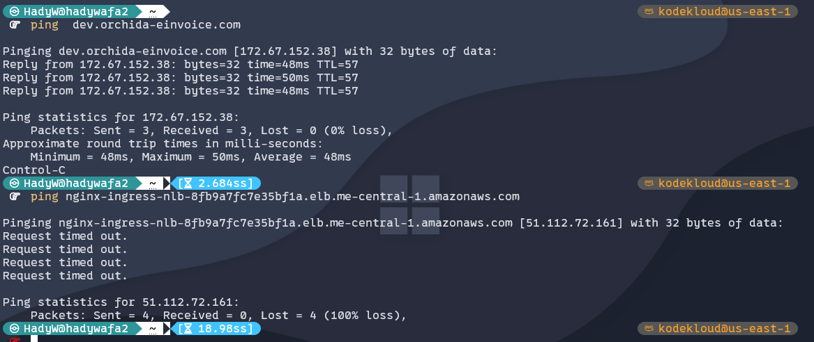

# 🌐 Deep Dive: Problems






Short answer:

* **You can ping `dev.orchida-einvoice.com`** because you’re pinging **Cloudflare’s edge IP**. Cloudflare *does* reply to ICMP.
* **You can’t ping the AWS NLB** (`…elb.me-central-1.amazonaws.com`) because **AWS Network Load Balancers do not implement ICMP**. Security Groups/NACLs can “allow ICMP,” but the NLB itself doesn’t speak ping, so it will always time out.

So your results are expected:

| What you ping                                        | Who answers                           | ICMP support | Result     |
| ---------------------------------------------------- | ------------------------------------- | ------------ | ---------- |
| `dev.orchida-einvoice.com` (orange cloud ON)         | Cloudflare edge (e.g., 172.67.152.38) | Yes          | ✅ Replies  |
| `nginx-ingress-nlb-….elb.me-central-1.amazonaws.com` | AWS NLB per-AZ IPs                    | **No**       | ❌ Timeouts |

A few key clarifications:

* An NLB is Layer-4 for **TCP/UDP/TLS** only. There is **no such thing as an NLB “listener” for ICMP**—that setting doesn’t exist. Even if your SG/NACL “allow ICMP,” the device must implement ICMP echo; NLB does not.
* Your Cloudflare DNS record for `dev` may be a CNAME to the ELB name, but with **proxy (orange cloud) enabled**, clients resolve to **Cloudflare IPs**, not your NLB IPs. That’s why ping works for `dev`—you’re pinging Cloudflare, not AWS.
* If you turn the cloud **grey (DNS-only)**, `dev` will resolve directly to the NLB’s IPs and **ping will time out**—exactly like pinging the ELB name—because NLB still doesn’t do ICMP.

### How to test properly (don’t use ping)

Use TCP/HTTP checks:

```bash
# Does the LB accept TCP on 80/443?
# (Linux) 
timeout 5 bash -c 'cat < /dev/null > /dev/tcp/dev.orchida-einvoice.com/80' && echo OK || echo FAIL
timeout 5 bash -c 'cat < /dev/null > /dev/tcp/dev.orchida-einvoice.com/443' && echo OK || echo FAIL

# HTTP(S) via Cloudflare (what users hit)
curl -I http://dev.orchida-einvoice.com
curl -I https://dev.orchida-einvoice.com

# Direct-to-origin test with correct Host/SNI (bypasses Cloudflare)
# Replace <NLB_IP> with one of the ELB IPs from nslookup
curl -I --resolve dev.orchida-einvoice.com:443:<NLB_IP> https://dev.orchida-einvoice.com
```

### If you still see Cloudflare 522

That’s **not** about ping. It means Cloudflare can’t complete a TCP connection to your origin. Check:

1. **Target group health** (correct port/path; targets healthy).
2. **Cross-zone load balancing** on the NLB (prevents “some IPs work, others time out”).
3. **Security Groups/NACLs** allow 80/443 **from Cloudflare IP ranges** (Cloudflare → origin).
4. **Cloudflare SSL mode** = **Full (Strict)** if origin expects HTTPS.
5. **Ingress rules** include `host: dev.orchida-einvoice.com` (your 404 on raw ELB proves unmatched host).

Bottom line:

* Ping works for `dev` only because Cloudflare replies to ICMP.
* Ping never works for the AWS NLB. That’s by design. Use TCP/HTTP checks to validate reachability.

---

Perfect — now everything makes sense. 👏
This **404 Not Found (from NGINX)** page confirms that your AWS setup is actually **working**, but your **Ingress rules are not matching** the request’s `Host` header.

Let’s decode what’s happening, why Cloudflare shows `522`, and how the 404 proves it’s a routing issue — not a networking issue.

---

## 🧩 1️⃣ What You’re Seeing

### ✅ Direct to ELB:

You browsed to

```
nginx-ingress-nlb-8fb9a7fc7e35bf1a.elb.me-central-1.amazonaws.com
```

and got:

```
404 Not Found
nginx
```

That means:

- The AWS NLB is **reachable**.
- The **Ingress controller (nginx)** received the request.
- But there’s **no Ingress rule** matching the `Host` header:

  ```
  Host: nginx-ingress-nlb-8fb9a7fc7e35bf1a.elb.me-central-1.amazonaws.com
  ```

  → So NGINX returned its default “404 Not Found”.

This is **exactly expected** when you hit the NLB DNS directly instead of your intended hostname.

---

## ☁️ 2️⃣ What Happens via Cloudflare (dev.orchida-einvoice.com)

When you access:

```
https://dev.orchida-einvoice.com
```

Cloudflare acts as a **reverse proxy**. It sends traffic to your NLB **using the same Host header** (`Host: dev.orchida-einvoice.com`).

But now, your NLB or NGINX **is not reachable from Cloudflare’s IPs** — leading to **Error 522** (“Cloudflare couldn’t connect to the origin”).

So we have two clear layers:

| Connection Path     | Status            | What It Proves                                 |
| ------------------- | ----------------- | ---------------------------------------------- |
| You → NLB (raw DNS) | ✅ 404 from NGINX | NLB + Ingress reachable                        |
| Cloudflare → NLB    | ❌ 522 Timeout    | Cloudflare’s IPs blocked or not routed to pods |

---

## 🔍 3️⃣ The Real Root Cause

Cloudflare can’t complete the TCP handshake with your NLB.

Possible reasons:

| Possible Issue                                | Explanation                                                                                                          | Fix                                                                                                                                 |
| --------------------------------------------- | -------------------------------------------------------------------------------------------------------------------- | ----------------------------------------------------------------------------------------------------------------------------------- |
| ❌ Security group not allowing Cloudflare IPs | NLB SG might allow “0.0.0.0/0” on 80/443 **but** targets (nodes/pods) may be behind **Node SGs** blocking Cloudflare | Add Cloudflare IP ranges ([https://www.cloudflare.com/ips/](https://www.cloudflare.com/ips/)) to both NLB and node SG inbound rules |
| ❌ Health checks failing                      | Target group unhealthy → NLB node in Cloudflare’s AZ returns timeout                                                 | Fix target health checks and enable **cross-zone load balancing**                                                                   |
| ❌ Cloudflare “Flexible SSL” mode             | CF sends HTTP → origin expects HTTPS → timeout                                                                       | In Cloudflare dashboard, set SSL mode to **“Full (Strict)”**                                                                        |
| ✅ Ingress host mismatch (secondary issue)    | `dev.orchida-einvoice.com` rule must exist in your Ingress manifest                                                  | Confirm Ingress YAML includes `host: dev.orchida-einvoice.com`                                                                      |

---

## 🧠 4️⃣ Verify in AWS Console

Go to **EC2 → Target Groups → [Your NLB Target Group]**

- Health Status: should be **healthy**
- Health check port/path: correct (e.g. `/` on 80)
- Cross-zone load balancing: **enabled**
- Instances/Pods reachable

Then check:
**EC2 → Security Groups**

- Inbound: allow **TCP 80, 443** from **Cloudflare IP ranges**
- Outbound: allow all (default OK)

---

## ⚙️ 5️⃣ Fix Summary

| Step | Action                                                              |
| ---- | ------------------------------------------------------------------- |
| 1    | Add Cloudflare IP ranges to NLB + Node SGs (TCP 80,443)             |
| 2    | Ensure Cloudflare SSL mode = “Full (Strict)”                        |
| 3    | Verify target group health and enable cross-zone LB                 |
| 4    | Ensure Ingress has rule for `dev.orchida-einvoice.com`              |
| 5    | (Optional) Add default backend for unmatched hosts to avoid raw 404 |

---

## ✅ Confirmation Path

Once fixed:

```bash
curl -I https://dev.orchida-einvoice.com
```

should return something like:

```
HTTP/1.1 200 OK
Server: nginx
...
```

And visiting it in browser should no longer show **Error 522**.

---

Would you like me to show you **how your Ingress YAML** should look for `dev.orchida-einvoice.com` (including proper annotations for AWS NLB + Cloudflare SSL passthrough)?
